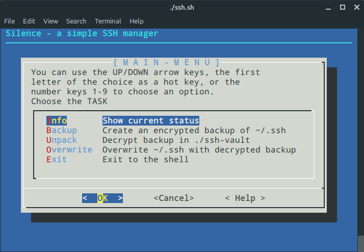

# silence - a tool for safely backing up your ssh keys

Tool for safely backing up ssh keys in an git repository.
The main idea of this is: to save a zipped and encrypted file on one of your **private** repositories

## Usage

#### Be brave, just try this online

##### Fork repo
You need to fork this repository and keep it **private** in your git cloud provider (Github/Bitbucket/Github). Reason for this is that you will have to keep an encrypted copy of your ssh keys.

##### Generate Backup

- run `./ssh/backup.sh`
- or run the interactive menu `./ssh-menu.sh`

This will create a file locally which will be encrypted. This file is stored at `./ssh-vault.tar.gz.gpg`

##### gitignore

You will have to modify .gitignore so that you can save the generated encrypted file in your git cloud provider

##### Use the backup

- run `./ssh/unpack.sh` && `./ssh/overwrite.sh`
- or run the interactive menu `./ssh-menu.sh`

Unpack will decrypt the `./ssh-vault.tar.gz.gpg` file and store it's contents uncrypted in the folder `./ssh-vault`

Overwrite will copy and overwrite the contents of `./ssh-vault` into `~/.ssh`

After this, it's good practice to delete `./ssh-vault` folder

Done! you're good to go.

## FAQ:

**Q:** OMG! Are you serious, do you understand how bad it is to store ssh keys online?

**A:** Yes, I get it, it's bad practice, but I preffer this over the pain of setting up my keys on each new machine I use.
##

**Q:** I don't trust you, are there better solutions?

**A:** Yes, try this: [SSH with Lastpass CLI](https://devopsheaven.com/ssh/security/lastpass/devops/2018/06/13/ssh-lastpass-cli.html)
##

## Todo:

- Create better diagnostics info
- Delete "ssh-vault" folder after overwriting
- Replicate current behaviour to save AWS credentials
- Replicate current behaviour to save rClone credentials
- Replicate current behaviour to save Lastpass credentials